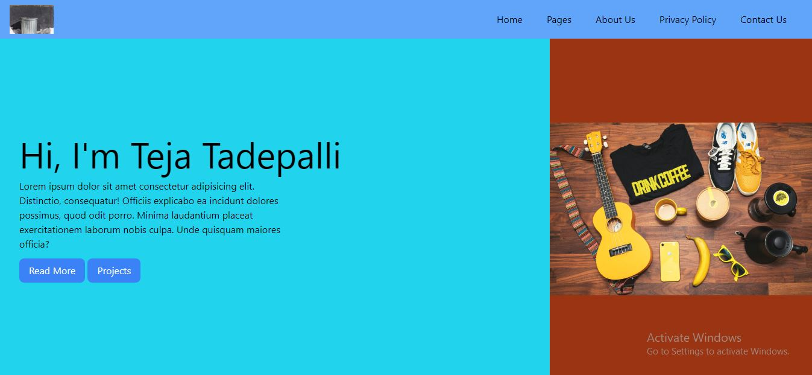
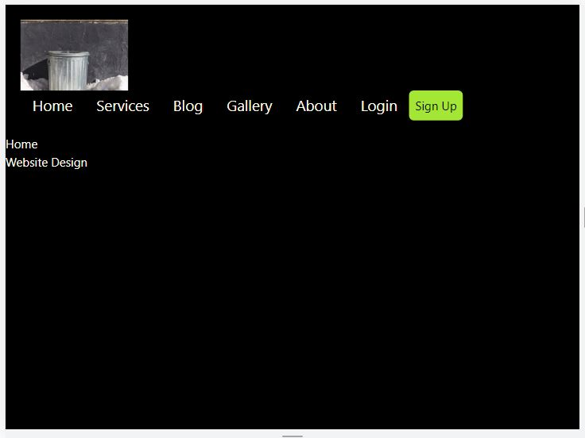

# [Udemy Course: Learn Tailwind CSS Quickly](https://www.udemy.com/course/learn-tailwind-css-quickly/)

## Learn Tailwind CSS Quickly
In this course I learnt the basics of Tailwind CSS and how to use it in my projects.
This was very straight and direct course and I learnt a lot from it.
In the end of this project I was able to make 2 projects using Tailwind CSS.
 
 

## Mini Project:
 

 

## Final Project:
#### Still need to finish the Banner section.
 
